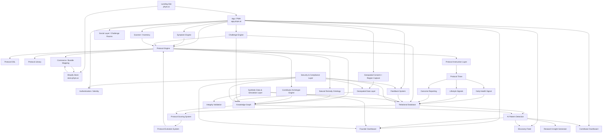
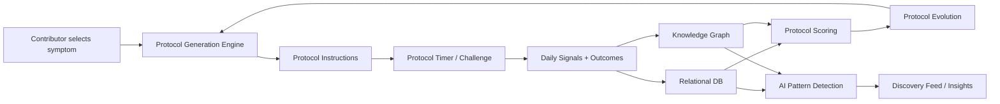
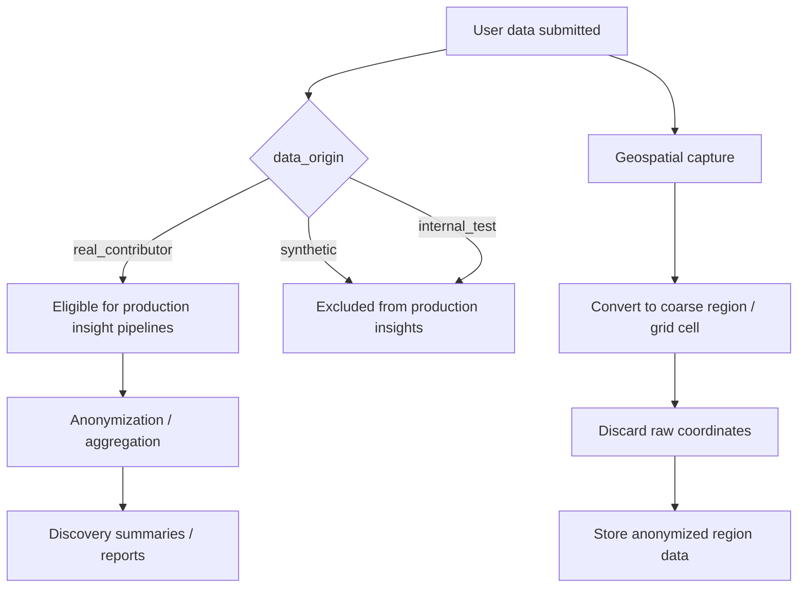
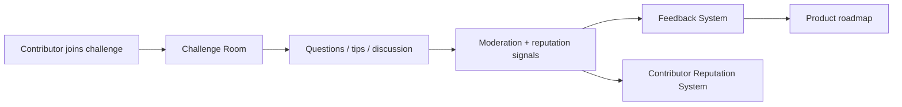

# Phyto.ai — Complete System Architecture Diagram

This document shows how the major platform systems connect.

## High-Level Architecture

---

## Data & Intelligence Flow

---

## Privacy & Integrity Flow

---

## Social & Feedback Flow

---

## Founder Dashboard Data Sources

The Founder / Operator Dashboard should pull from:
- contributor acquisition metrics
- challenge participation
- protocol runs
- outcome reports
- adherence rates
- discovery insight generation
- geospatial summaries
- revenue metrics
- feedback volume / feature requests
- reputation distribution
- synthetic data exclusion validation